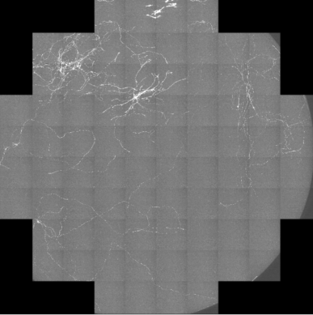
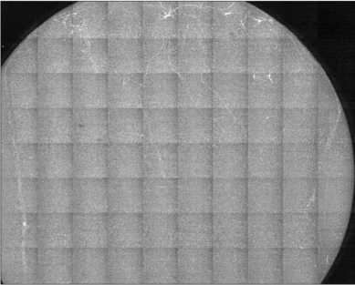

# stitching
batch stitching of images using [wholebrainsoftware](https://github.com/tractatus/wholebrain)
Additional utilities from wholebrainsoftware also present [here](https://github.com/tractatus/wholebrain-examples) 

## installing wholebrain software

- Windows [updated instructions](https://github.com/wAOndering/stitching/blob/master/docs/WholeBrainWindowsInstallNov2018.pdf)
- For Linux and MacOS see:
	- [gitter channel](https://gitter.im/tractatus/Lobby)
	- [wholebrainsoftware website](http://www.wholebrainsoftware.org/cms/install/)

## using the stitching batch program

- Open command line (cmd) or terminal

```R
> cmd
> R
> source('C:/git/stitching/main.r')
```
## stitching option



_**eg. 1** Output from `option1` ._



_**eg. 2** Output from `option2` ._
